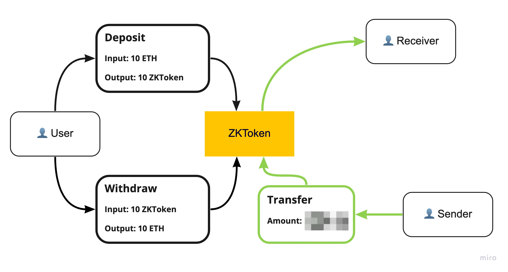
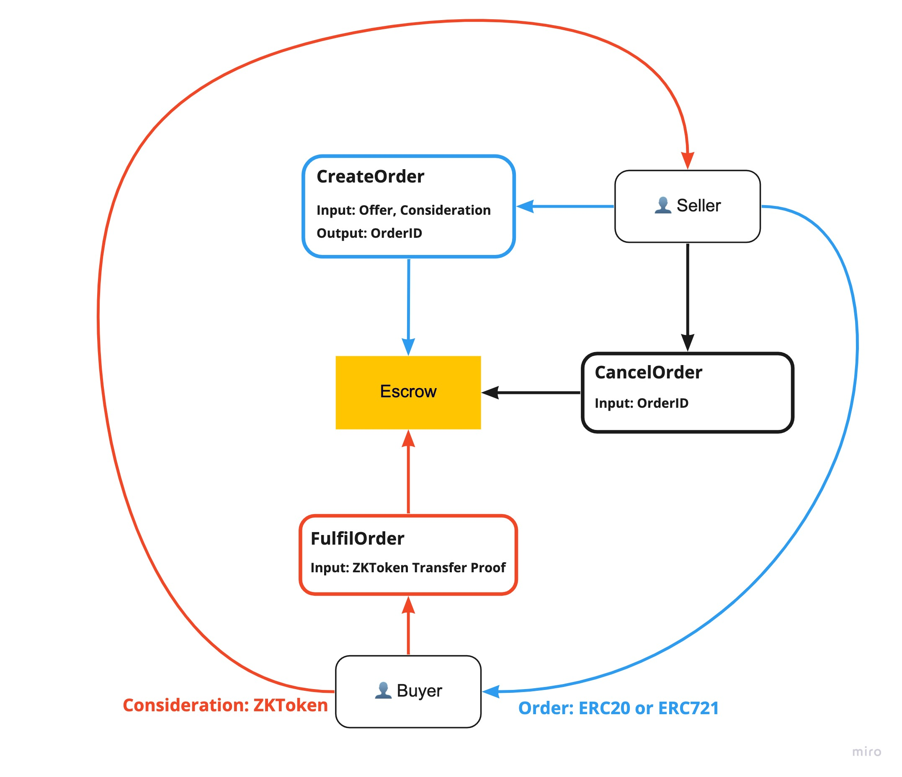

# UnderSea Core 

**UnderSea is a privacy-preserved NFT marketplace**. You can trade ERC20/ERC721 without revealing how much you paid/received.

## Install

To install dependencies and compile circuits

```bash
git clone https://github.com/wuwe1/undersea-core && cd undersea-core
yarn
yarn circom:dev
```

## How it works

This repo contains two contracts:

### ZKToken

accepts deposits of ETH from users. ZKToken implements confidential transactions which allows users to transfer ZKToken without revealing the amount of the transaction.



### Escrow

allows seller who possess ERC20 or ERC721 token to create selling order and allows buyer who have enough ZKToken to fulfil the order. The negotiation between seller and buyer happens off-chain.

